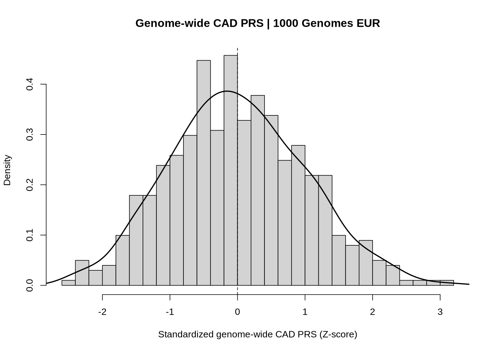
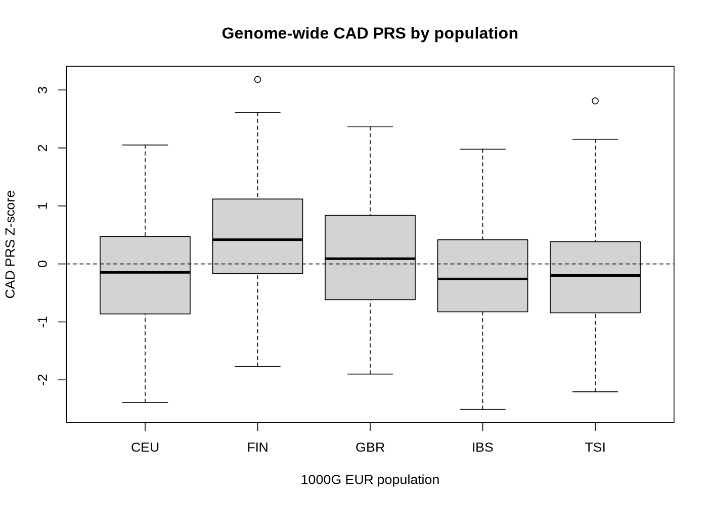
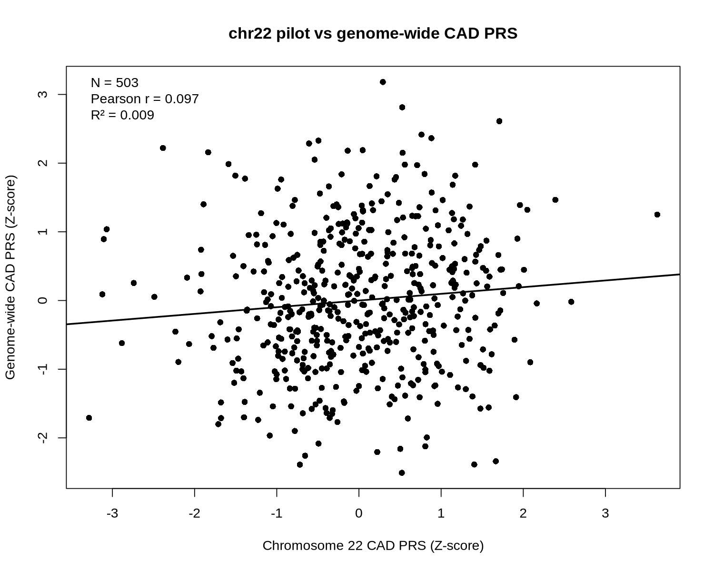

# Exploring Polygenic Risk Scores

A step-by-step learning and implementation project moving from basic PRS calculation to allele harmonization, LD-aware methods, and a real genome-wide CAD PRS application.

The project deliberately starts with tiny examples so that each assumption is visible, then progresses to PRSice, LDpred2, PRS-CS, a real chromosome-22 CAD pilot, and finally a genome-wide PRS across autosomes 1–22.

> **Scope:** methodological learning + real-data scoring.  
> **Not:** a clinically validated CAD prediction model.

## Learning path

**01 · Foundations**  
`Toy PRS` → `Allele harmonization` → `LD clumping` → `Clumping & thresholding`

**02 · PRS methods**  
`PRSice-2` → `LDpred2` → `PRS-CS`

**03 · Real-world CAD case study**  
`chr22 pilot` → `Genome-wide CAD PRS` → `Population comparison`


## Final outcome

The project ends with a real genome-wide CAD scoring workflow:

- real CAD GWAS summary statistics: **GCST90132314**;
- GWAS QC and HapMap3 harmonization across chr1–22;
- **1,119,312** retained HapMap3-matched SNPs across autosomes;
- PRS-CS-auto posterior SNP effect estimation by chromosome;
- **503** European-ancestry individuals from 1000 Genomes Phase 3;
- chromosome-specific PLINK2 scoring summed to a genome-wide PRS;
- population-level score comparison across CEU, FIN, GBR, IBS, and TSI;
- direct comparison of the earlier chr22 pilot with the final genome-wide score.

## Why this project

I started this project because I wanted to understand what happens between a GWAS summary-statistics file and the final PRS value assigned to an individual.

Instead of starting directly with a large PRS package, I first built small examples to understand effect-allele direction, LD, clumping, P-value thresholding, and effect-size shrinkage. I then moved to LDpred2 and PRS-CS, and finally applied the workflow to real coronary artery disease GWAS data and real 1000 Genomes genotypes.

The goal was not just to learn commands, but to understand **why each step is necessary and what can go wrong even when software runs successfully**.

---

# Part 1 — Understanding the foundations

| Stage | Main question | Main lesson |
|---|---|---|
| [01 Toy PRS](01_foundations/01_toy_prs/) | What is an individual PRS calculating? | `PRS = Σ dosage × effect size` |
| [02 Harmonization](01_foundations/02_allele_harmonization/) | Why can a technically successful score still be wrong? | Effect alleles and beta direction must agree |
| [03 LD & clumping](01_foundations/03_ld_clumping/) | Why not count every associated SNP? | Correlated SNPs can duplicate genetic information |
| [04 Manual C+T](01_foundations/04_clumping_and_thresholding/) | How do LD and P-value thresholds define the SNP set? | Clumping + thresholding is a classical PRS strategy |

A deliberately misaligned toy example was especially useful: PLINK produced a valid score file even though the effect-allele direction had been made biologically inconsistent. This became an early reminder that **“no software error” is not the same as “correct analysis.”**

---

# Part 2 — Moving to modern PRS methods

| Method | Core idea | What it added |
|---|---|---|
| [PRSice](02_prs_methods/01_prsice2/) | automated C+T | threshold search and model comparison |
| [LDpred2](02_prs_methods/02_ldpred2/) | Bayesian LD-aware model | posterior SNP effects + chain diagnostics |
| [PRS-CS](02_prs_methods/03_prscs/) | continuous shrinkage prior | external LD reference + adaptive Bayesian shrinkage |

The main conceptual transition was:

> **C+T:** which SNPs should be kept?  
> **LDpred2 / PRS-CS:** given LD, what posterior weight should each SNP receive?

### PRSice example

The retained PRSice output from the tutorial dataset gave:

- N = 2,000 (1,000 cases / 1,000 controls);
- best P-value threshold = 0.4463;
- 36,759 SNPs in the best PRS;
- PRS R² = 0.0520;
- OR per SD = 1.509 (95% CI 1.375–1.656).

These are tutorial-data results, not the final CAD case study.

---

# Part 3 — Real-world CAD PRS

## Step 1: chromosome-22 pilot

Before scaling to the full genome, the complete real-data workflow was tested on chromosome 22:

```text
real CAD GWAS
→ SNP / MAF / statistics QC
→ HapMap3 position + allele harmonization
→ frequency consistency QC
→ 1000G EUR target preparation
→ PRS-CS-auto
→ posterior SNP effects
→ PLINK2 scoring
→ individual chr22 PRS
```

The final chr22 scoring set contained **16,431 SNPs** in **503 1000G EUR individuals**.

The pilot was used to debug the workflow. It was **not** treated as a chromosome-22 CAD prediction model.

## Step 2: genome-wide implementation

The validated logic was then generalized to autosomes 1–22.

The successful genome-wide run:

- downloaded and validated 1000 Genomes Phase 3 autosomal VCFs;
- processed each chromosome independently;
- retained **1,119,312** HapMap3-matched SNPs after genome-wide QC;
- used a post-QC median effective GWAS sample size of **601,956** as the single PRS-CS `n_gwas` approximation;
- ran PRS-CS-auto in parallel across 22 chromosomes;
- calculated chromosome-specific scores with PLINK2;
- summed chr1–22 to obtain the final genome-wide PRS.

## Genome-wide PRS distribution



The final score showed a continuous distribution across the 503 European-ancestry target individuals.

## PRS distribution across 1000G EUR subpopulations



Population-level score distributions differed across CEU, FIN, GBR, IBS, and TSI:

- one-way ANOVA: `p = 1.75 × 10^-7`
- Kruskal-Wallis: `p = 3.33 × 10^-6`

These are **PRS distribution shifts**, not evidence that one population has intrinsically higher or lower CAD incidence.

## chr22 pilot vs genome-wide PRS



For the same 503 individuals:

- Pearson `r = 0.0973`
- Spearman `rho = 0.1215`
- linear-model `R² = 0.00948`

The weak relationship illustrates why a single-chromosome pilot can validate a pipeline but cannot substitute for a genome-wide polygenic score.

See the dedicated comparison folder: [03_chr22_vs_genomewide](03_cad_case_study/03_chr22_vs_genomewide/).

---

# What I learned

- PRS calculation is simple; reliable PRS construction is not.
- Allele harmonization can change the biological meaning of a score even when the software runs without errors.
- LD must be handled explicitly when combining GWAS effects.
- C+T selects SNPs; modern Bayesian methods instead re-estimate LD-adjusted posterior SNP effects.
- PRS-CS and LDpred2 make the effect-size shrinkage step visible in different ways.
- GWAS ancestry, LD-reference ancestry, and target ancestry all matter.
- A technically successful PRS is **not** the same thing as a clinically validated prediction model.
- A single-chromosome pilot is useful for debugging but can capture very little of the final genome-wide score.

# Repository structure

```text
exploring-polygenic-risk-scores/
├── README.md
├── 01_foundations/
│   ├── README.md
│   ├── 01_toy_prs/
│   ├── 02_allele_harmonization/
│   ├── 03_ld_clumping/
│   └── 04_clumping_and_thresholding/
├── 02_prs_methods/
│   ├── README.md
│   ├── 01_prsice2/
│   ├── 02_ldpred2/
│   └── 03_prscs/
├── 03_cad_case_study/
│   ├── README.md
│   ├── 01_chr22_pilot/
│   ├── 02_genomewide_prs/
│   └── 03_chr22_vs_genomewide/
├── figures/
├── results/summary/
├── docs/
├── .gitignore
└── NOTICE.md
```

# Repository contents

This repository keeps the learning examples, selected analysis scripts, compact summary tables, and final figures used to document the progression from basic PRS concepts to the real-world CAD case study.

Large public datasets, individual-level target genotypes, LD reference files, large intermediate objects, software binaries, and compute-environment configuration are not included.

See:

- [Learning notes](docs/01_learning_notes.md)
- [Methods](docs/02_methods.md)
- [Real-world CAD case study](docs/03_real_world_CAD_case_study.md)
- [Troubleshooting](docs/04_troubleshooting.md)
- [Limitations](docs/05_limitations.md)

# Data and method references

- Aragam KG et al. **Discovery and systematic characterization of risk variants and genes for coronary artery disease in over a million participants.** *Nature Genetics* (2022). GWAS Catalog accession: `GCST90132314`.
- Ge T et al. **Polygenic prediction via Bayesian regression and continuous shrinkage priors.** *Nature Communications* (2019).
- Privé F et al. **LDpred2: better, faster, stronger.** *Bioinformatics* (2020).
- 1000 Genomes Project Phase 3.
- PLINK / PLINK2.
- PRSice-2.

# Important interpretation boundary

This repository demonstrates **genome-wide PRS construction and scoring**.

The 503 target individuals are not an independent CAD phenotype-validation cohort in this project. Therefore, this repository does **not** claim:

- CAD prediction AUC;
- odds ratio per genome-wide CAD PRS SD;
- calibration;
- top-decile CAD risk;
- clinical utility.

Those questions require an independent phenotype-labelled target cohort.
